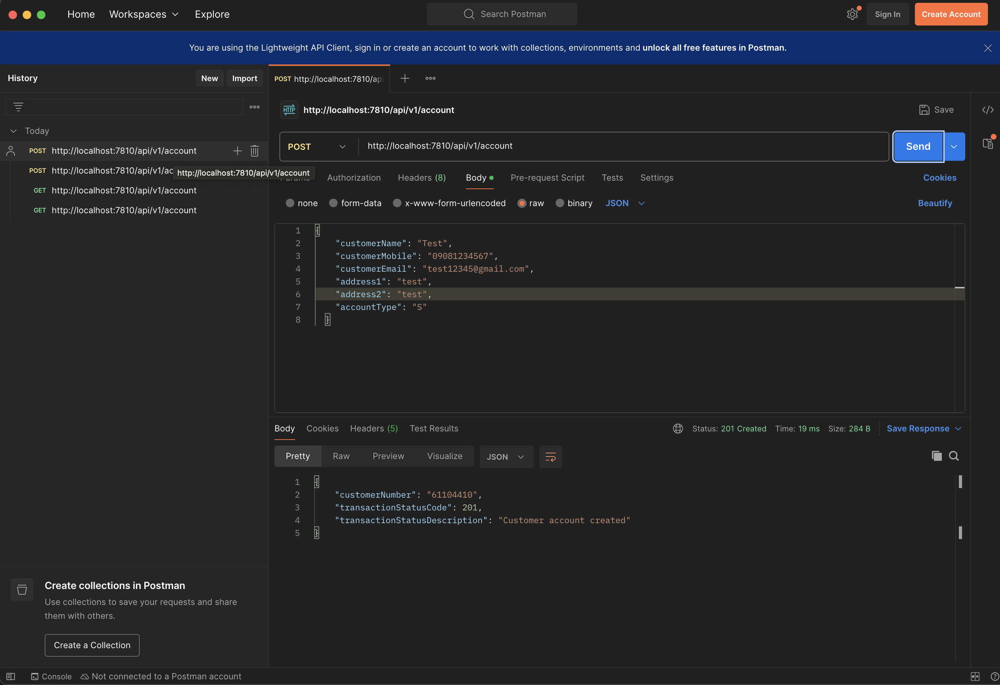
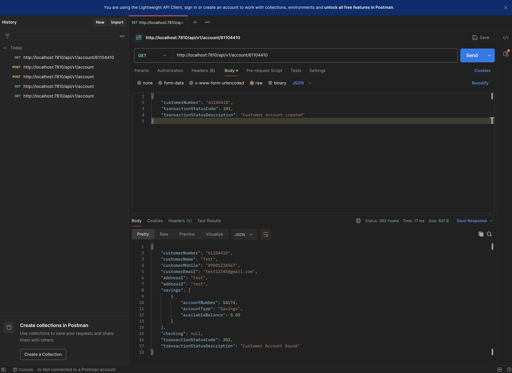

# Account Service - Java Microservice

A RESTful microservice for customer account management built with Java 8, Spring Boot 2.6, and H2 in-memory database.

## Technologies Used

- **Java 8**
- **Spring Boot 2.6.14**
- **Spring Data JPA**
- **H2 Database** (in-memory)
- **Maven**

## Project Structure

```
Project01/
├── pom.xml
├── src/
│   ├── main/
│   │   ├── java/com/exam/account/
│   │   │   ├── AccountApplication.java
│   │   │   ├── controller/
│   │   │   │   └── AccountController.java
│   │   │   ├── service/
│   │   │   │   └── AccountService.java
│   │   │   ├── repository/
│   │   │   │   ├── CustomerRepository.java
│   │   │   │   └── AccountRepository.java
│   │   │   ├── model/
│   │   │   │   ├── Customer.java
│   │   │   │   └── Account.java
│   │   │   ├── dto/
│   │   │   │   ├── AccountRequest.java
│   │   │   │   ├── AccountResponse.java
│   │   │   │   ├── AccountDto.java
│   │   │   │   └── CustomerInquiryResponse.java
│   │   │   ├── enums/
│   │   │   │   └── AccountType.java
│   │   │   └── exception/
│   │   │       ├── GlobalExceptionHandler.java
│   │   │       └── CustomerNotFoundException.java
│   │   └── resources/
│   │       └── application.properties
│   └── test/
│       └── java/com/exam/account/
│           └── AccountControllerTest.java
└── README.md
```

## API Endpoints

### 1. Create Account

Creates a new customer account.

| Property | Value |
|----------|-------|
| **URL** | `/api/v1/account` |
| **Method** | `POST` |
| **Content-Type** | `application/json` |

#### Request Body

| Field | Type | Required | Validated |
|-------|------|----------|-----------|
| customerName | String (50) | Yes | No |
| customerMobile | String (20) | Yes | No |
| customerEmail | String (50) | Yes | Yes (email format) |
| address1 | String (100) | Yes | No |
| address2 | String (100) | No | No |
| accountType | Enum | Yes | Yes (S or C) |

**Account Types:**
- `S` - Savings
- `C` - Checking

#### Sample Request

```json
{
  "customerName": "Test",
  "customerMobile": "09081234567",
  "customerEmail": "test12345@gmail.com",
  "address1": "test",
  "address2": "test",
  "accountType": "S"
}
```

#### Success Response (201 Created)

```json
{
  "customerNumber": "12345678",
  "transactionStatusCode": 201,
  "transactionStatusDescription": "Customer account created"
}
```

#### Error Response (400 Bad Request)

```json
{
  "customerNumber": null,
  "transactionStatusCode": 400,
  "transactionStatusDescription": "Email is required field"
}
```

---

### 2. Get Customer

Retrieves customer account information by customer number.

| Property | Value |
|----------|-------|
| **URL** | `/api/v1/account/{customerNumber}` |
| **Method** | `GET` |

#### Success Response (302 Found)

```json
{
  "customerNumber": "12345678",
  "customerName": "Test",
  "customerMobile": "09081234567",
  "customerEmail": "test12345@gmail.com",
  "address1": "test",
  "address2": "test",
  "savings": [
    {
      "accountNumber": 10001,
      "accountType": "Savings",
      "availableBalance": 0.00
    }
  ],
  "checking": null,
  "transactionStatusCode": 302,
  "transactionStatusDescription": "Customer Account found"
}
```

#### Error Response (404 Not Found)

```json
{
  "transactionStatusCode": 401,
  "transactionStatusDescription": "Customer not found"
}
```

---

## How to Run

### Prerequisites

- Java 8 or higher
- Maven 3.x

### Build and Run

```bash
# Navigate to project directory
cd Project01

# Build the project
mvn clean install

# Run the application
mvn spring-boot:run
```

The application will start on `http://localhost:7810`

### Run Tests

```bash
mvn test
```

---

## Postman Test Results

### 1. Create Account - Success (201 Created)



### 2. Get Customer - Success (302 Found)



### 3. Get Customer - Not Found (404 Not Found)


### 4. Create Account - Validation Error (400 Bad Request)


---

## Database

The application uses H2 in-memory database. You can access the H2 console at:

- **URL:** `http://localhost:7810/h2-console`
- **JDBC URL:** `jdbc:h2:mem:accountdb`
- **Username:** `sa`
- **Password:** (empty)

---

## Author

**Anthony Castor**

Java Microservice Coding Exam Submission
